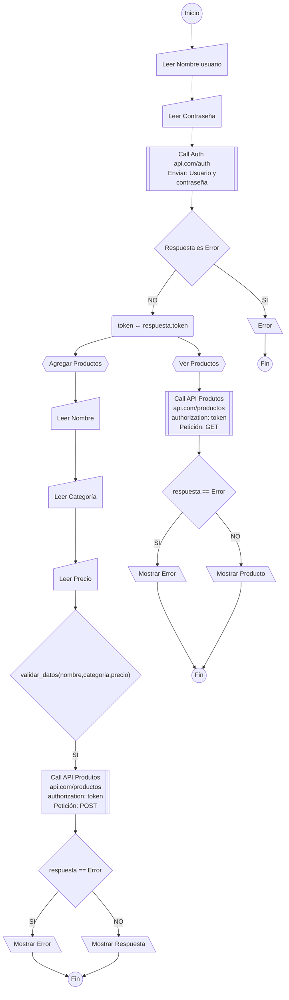
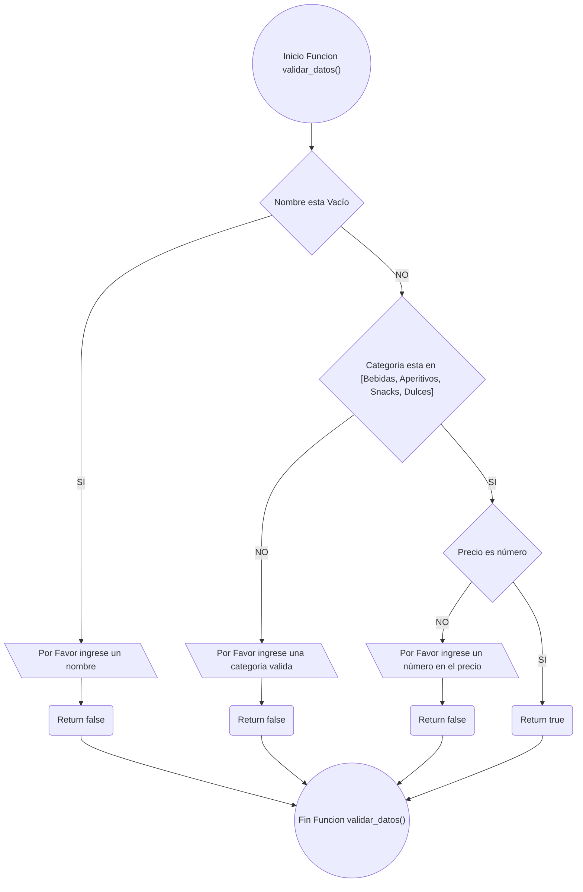
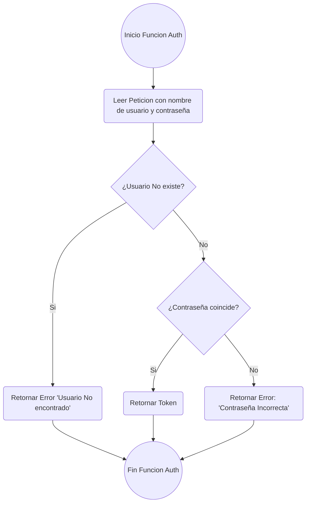
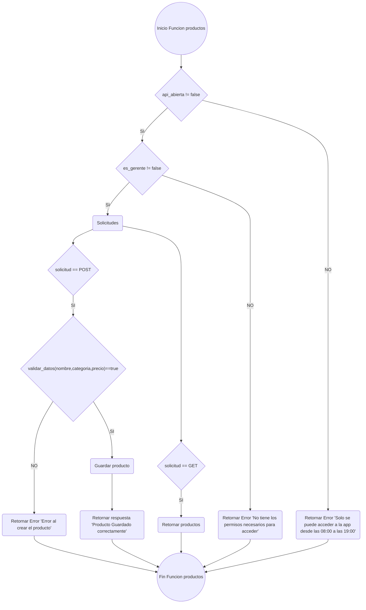
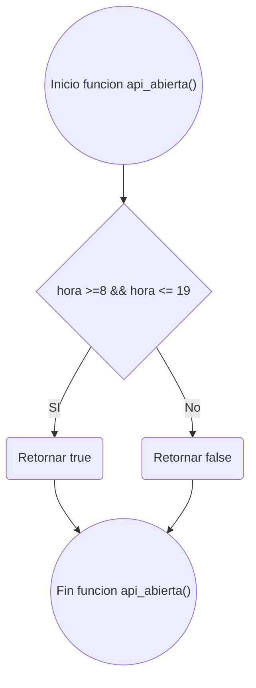
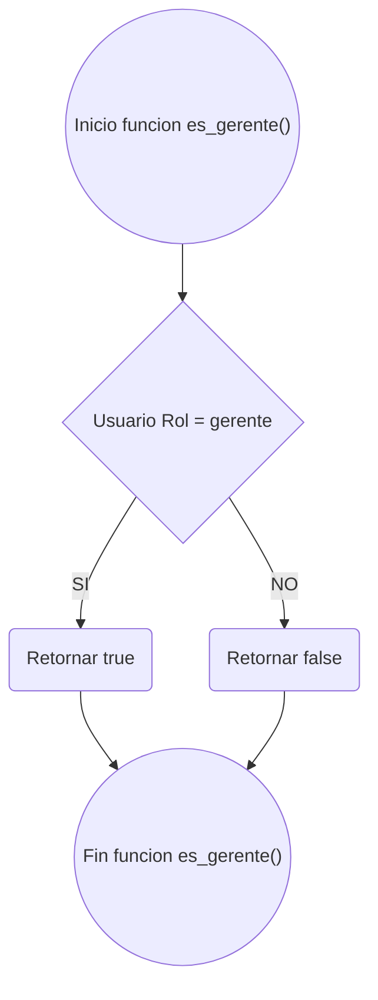

# Pseudocodigo y Diagramas de flujo
---
## FrontEnd

```
INICIO

    LEER usuario.
    LEER contraseña.
        LLAMAR 
            api auth: api.com/auth
            enviar: usuario, contraseña
        Respuesta:
            SI respuesta ES Error ENTONCES
                mostrar: error
            SINO
                token ← token
                **Dar acceso a la aplicación

    ** Una vez accedido a la aplicación

    ** Ver lista de productos

        LLAMAR
            api productos: api.com/productos,
            authorization: token.
            petición: GET
        Respuesta
            SI respuesta ES Error ENTONCES
                mostrar: error
            SINO
                mostrar: productos

    ** Guardar productos
    
    LEER nombre.
    LEER categoría.
    LEER precio

    SI validar_datos(nombre, categoria, precio) ENTONCES
        LLAMAR
            api productos: api.com/productos,
            enviar: nombre, categoría, precio,
            authorization: token.
            petición: POST
        Respuesta:
            SI respuesta ES error ENTONCES
                mostrar: error
            SINO
                mostrar: respuesta
        


    FUNCION validar_datos(nombre, categoría, precio): boolean
        
        SI nombre Es Vacío
            MOSTRAR "Por Favor ingrese un nombre"
            RETORNAR false

        SI categoría NO ES [Bebidas, Aperitivos, Snacks, Dulces] ENTONCES
            MOSTRAR "Por favor ingrese una categoría valida"
            RETORNAR false

        SI precio NO ES número ENTONCES
            MOSTRAR "Por favor introduce un valor númerico".
            RETORNAR false

        RETORNAR true

    FIN_FUNCION

FIN
```



### Funcion validar_datos(nombre,categoria,precio)



---
## BackEnd

```
INICIO

    FUNCION auth(usuario, contraseña)
        LEER petición con el nombre de usuario y contraseña.
        ** se busca el usuario y se confirma la contraseña.
            SI usuario no existe ENTONCES
                RETORNAR Error "Usuario No Encontrado".
            SINO
                ** Si el usuario si se encuentra, se verifica la contraseña.
                SI contraseña coincide ENTONCES
                    RETORNAR respuesta: token.
                SINO 
                    RETORNAR Error: "Contraseña incorrecta".
    FIN_FUNCION auth


    FUNCION productos(solicitud)
    
    ** Verificar si son horas en las que la api puede ser accedida (08:00 a 19:00)
    SI NO api_abierta() ENTONCES
        RETORNAR Error "Solo Se puede acceder a desde las 08:00 hasta las 19:00"

    ** Verificar que el usuario que realiza la solicitud tenga el rol de gerente
    SI NO es_gerente(token) ENTONCES
        RETORNAR Error "No tiene los permisos necesarios para acceder"
           

    ** Si la solicitud es GET (para obtener los productos)
    SI solicitud ES GET ENTONCES
        RETORNAR productos

    
    SI solicitud ES POST ENTONCES
    
        SI validar_datos(nombre,categoria,precio) ENTONCES
            GUARDAR producto
            RETORNAR respuesta "Producto guardado correctamente"
        SINO
            RETORNAR Error "Error al crear el producto"
        

    FIN_FUNCION productos

    
    FUNCION api_abierta(): boolean
        SI hora >= 8:00 && <= 19:00
            RETORNAR true
        RETORNAR false
    FIN_FUNCION api_abierta

    
    FUNCTION es_gerente(token): boolean
        Si Usuario Rol = gerente
            RETORNAR true
        RETORNAR false
    FIN_FUNCION es_gerente


    FUNCION validar_datos(nombre, categoría, precio): boolean
        
        SI nombre Es Vacío
            MOSTRAR "Por Favor ingrese un nombre"
            RETORNAR false

        SI categoría NO ES [Bebidas, Aperitivos, Snacks, Dulces] ENTONCES
            MOSTRAR "Por favor ingrese una categoría valida"
            RETORNAR false

        SI precio NO ES número ENTONCES
            MOSTRAR "Por favor introduce un valor númerico".
            RETORNAR false

        RETORNAR true

    FIN_FUNCION validar_datos
    
FIN
```

### Función Auth


### Funcion productos


### Funcion api_abierta



### Funcion es_gerente()



### Funcion validar_datos(nombre,categoria,precio)


