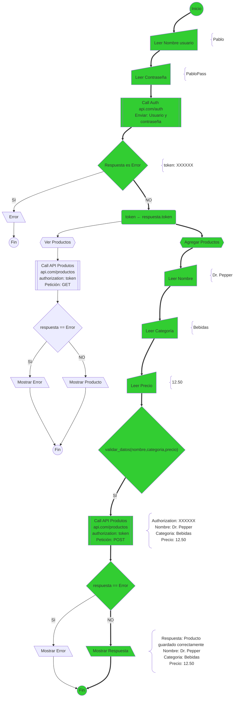
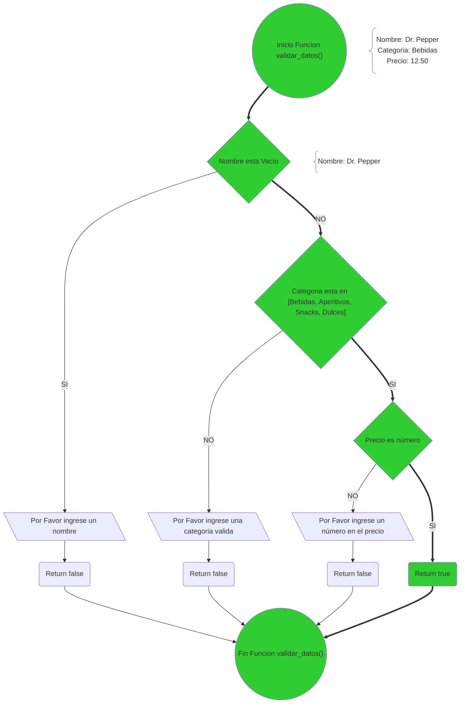
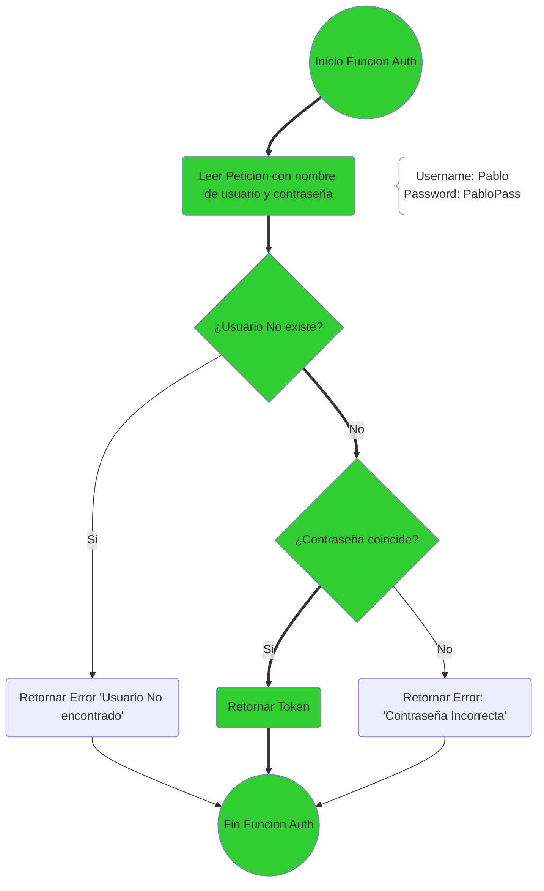
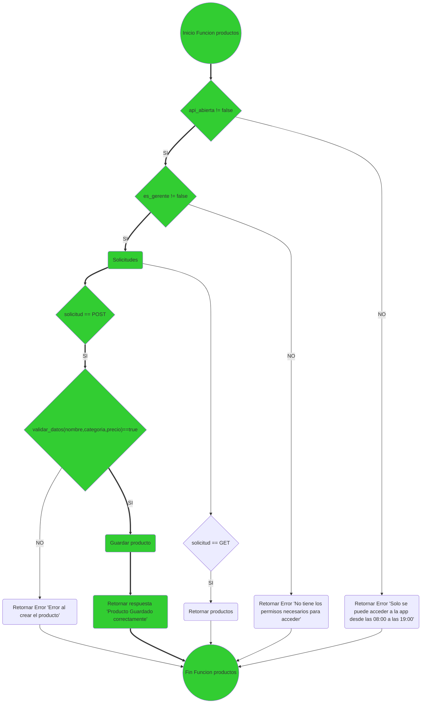
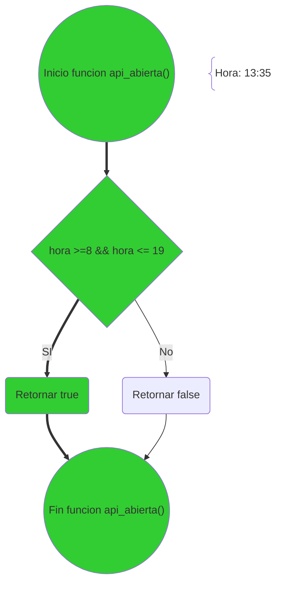
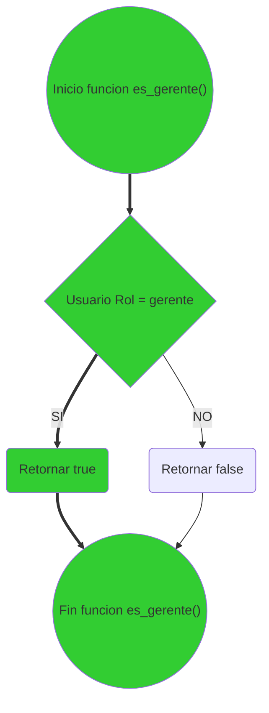
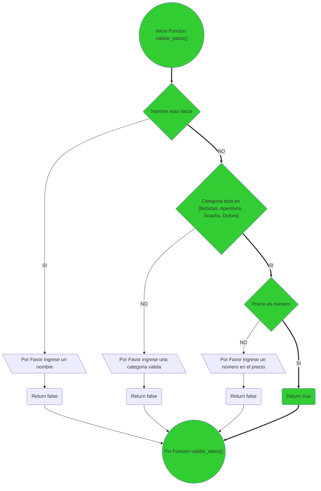

# Case 1

> Usuario: Pablo
> Password: PabloPass
> Rol: Gerente
> Hora: 13:35
> Producto: Dr. Pepper
> Categoria: Bebidas
> Precio: 12.50

---
## FrontEnd

### Function validar_datos(nombre,categoria,precio)

---
## BackEnd

### Function Auth

### Function productos

### Funcion api_abierta

### Funcion es_gerente()

### Funcion validar_datos(nombre,categoria,precio)

